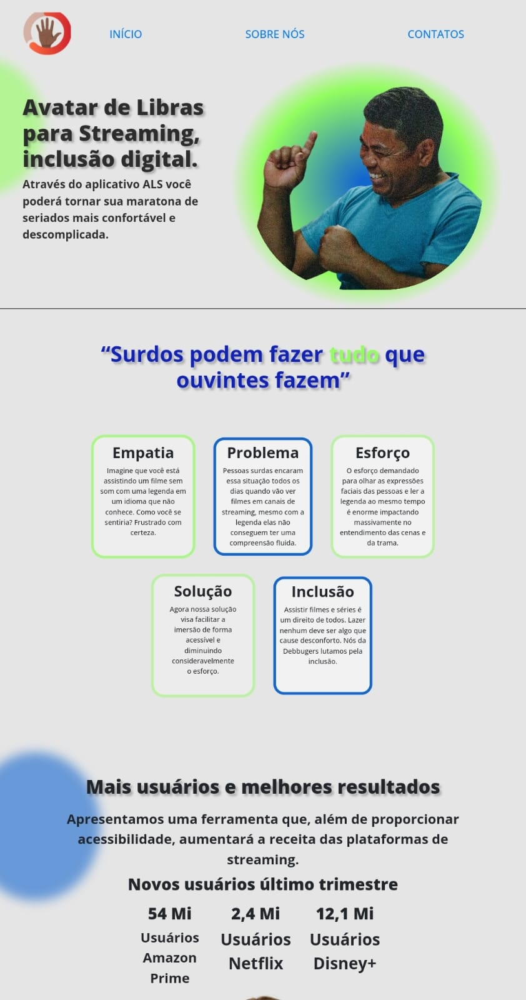

<h1 align="center"> Landing Page - Avatar de Libras para Streaming </h1>

Site real utilizando Bootstrap, ferramentas de responsividade, Flexbox e Grid .  

  <a href="#rocket-tecnologia">Tecnologias</a>&nbsp;&nbsp;&nbsp;|&nbsp;&nbsp;&nbsp;
  <a href="#computer-projeto---acesse-aqui">Projeto</a>&nbsp;&nbsp;&nbsp;|&nbsp;&nbsp;&nbsp;
  <a href="#memo-licença">Licença</a>

  

 

  

## :rocket: Tecnologia

Esse projeto foi desenvolvido com as seguintes tecnologias:

- HTML
- CSS
- Bootstrap
- Figma

## :computer: Projeto - [Acesse aqui](https://allanpt.github.io/Mais1Code_Project_Landing_Page/)

Esse projeto tem por conceito implementar uma nova ferramenta dentro das plataformas de streaming. Com ela, a absorção dos conteúdos dentro da plataforma será mais eficiente pela comunidade surda.

Um membro de design da nossa equipe foi resposável pelo layout, e montou o projeto no figma. 

Acesse o layout abaixo.

### [Figma](https://www.figma.com/file/vNWsgLcBGpidOdSu75VUGE/Untitled?type=design&node-id=0-1&mode=design&t=YGMHFFPoXZ9HhmPB-0)

E com a ajuda dos colegas. Eu pude 'codar' completamente a Landing Page do projeto.

O projeto ainda não está completo. Aguarde para mais atualizações.

## :memo: Licença

Esse projeto está sob a licença MIT.